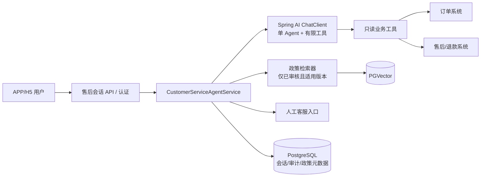

# 电商售后智能客服 Agent：架构与分阶段开发计划

**版本**：V1.0，2026-09-23  
**依据**：[需求设计文档](./电商售后智能客服Agent-PRD.md)  
**目标**：先交付可上线的只读售后 Agent，再逐步增加办理能力。本文以现有 Java 项目为落地基线；工期以订单、售后和人工客服接口可用为前提。

## 1. 先做什么

### 首版 MVP 的用户价值

客户登录后，可以问“我的订单发货了吗”“退款到哪一步了”“这件商品怎么退”。Agent 读取**本人订单和售后系统的实时状态**，从**已审核的售后政策**解释下一步；查不到或有争议时提供人工入口，并把问题摘要交给人工。首版只读，不创建退货单、不打款、不赔付。

### 首版范围

| 必做 | 首版暂缓 |
|---|---|
| 一个 APP/H5 售后会话入口；登录身份校验 | 微信、电话、第三方平台多渠道 |
| 已审核政策问答，回答附来源和适用版本 | 后台可视化政策发布系统；初期由运营审核文件并由现有导入流程发布 |
| 查询本人订单概要和已有售后/退款进度 | 退货申请、换货、补发、催件、赔付等写操作 |
| 会话上下文、未命中/接口错误降级、人工入口 | 多 Agent 协作、复杂工作流引擎、长期用户画像 |
| 最小审计和一组固定评测题 | 独立评测平台、向量数据库迁移、消息队列 |

**判断首版完成的标准**：用户无需人工即可完成常见政策和进度查询；任何订单信息都经服务端权限校验；Agent 不会将“查询失败”说成“退款成功”；转人工可带订单和会话摘要。

## 2. 项目现状与技术路线

当前项目使用 Java 17、Spring Boot 4.1.1、Spring AI 2.0.1、PostgreSQL/PGVector、Flyway、DeepSeek 聊天模型和兼容 OpenAI 接口的嵌入模型；`CustomerServiceAgent` 目前只有系统提示词和单轮 `chat(String)`。`PdfKnowledgeServiceImpl` 已能检索向量片段并回答，但当前检索没有售后政策范围过滤；订单、售后和身份工具尚不存在。

**技术选择**：沿用 Spring Boot + Spring AI + PostgreSQL，业务系统通过 HTTP 接入。Java 团队继续使用熟悉的 Controller/Service/Repository、SQL、Maven 和 JUnit 方式开发。Spring AI 提供 `ChatClient`、工具调用、RAG、会话记忆等接口；Spring Boot 的 Actuator/Micrometer 可用于指标和链路追踪。[Spring AI 工具调用](https://docs.spring.io/spring-ai/reference/api/tools.html)、[RAG](https://docs.spring.io/spring-ai/reference/api/retrieval-augmented-generation.html)、[会话记忆](https://docs.spring.io/spring-ai/reference/api/chat-memory.html)、[Spring Boot 可观测性](https://docs.spring.io/spring-boot/reference/actuator/observability.html)。

当前 `pom.xml` 同时含 Spring AI 与 LangChain4j。售后 Agent **只使用 Spring AI 一条实现链**，避免维护两套工具、记忆和调用语义；现有其他演示功能无需因此重写。选择依据是项目已有 `ChatClient`、向量检索和 Spring 生态接入，而非对框架市场份额的判断。

| 需要 | 首选技术 | 选型理由与增加时机 |
|---|---|---|
| Agent 对话和工具 | 现有 Spring AI `ChatClient` + `@Tool`/工具回调 | 已在项目中；工具由应用执行，模型只请求调用 |
| 政策检索 | 现有 PostgreSQL + PGVector；检索时按售后知识库、状态、适用范围过滤 | 复用已有设施；少量短政策可直接精确查表，无须强行向量化 |
| 身份和权限 | 复用公司登录网关；服务内用 Spring Security 或现有认证机制验证 token | `userId` 来自认证上下文，不从模型参数获取；若公司已统一鉴权，避免重复建设。[Spring Security Resource Server](https://docs.spring.io/spring-security/reference/servlet/oauth2/) |
| 业务接口 | Spring `RestClient`，沿用公司接口规范 | 常规 HTTP/JSON，开发者容易接手；统一超时和错误码。[Spring REST Clients](https://docs.spring.io/spring-framework/reference/integration/rest-clients.html) |
| 会话存储 | PostgreSQL；短窗口可用 Spring AI JDBC Chat Memory，完整审计单独存表 | 现有数据库足够；Chat Memory 不能替代完整会话审计。[Spring AI Chat Memory](https://docs.spring.io/spring-ai/reference/api/chat-memory.html) |
| 数据库变更 | 现有 Flyway | 管理会话/审计/政策元数据表迁移 |
| 测试和评测 | JUnit + 业务接口 mock + 固定问答样本 | 先让关键链路可回归；有量化瓶颈再引入专门评测平台 |
| 观测 | 日志 + Actuator/Micrometer；对接公司现有监控 | 先采集延迟、工具错误、转人工、错答指标 |

Redis、Kafka、工作流引擎和专用向量库不在首版依赖清单。出现多实例会话性能问题、异步任务积压或复杂跨系统流程时再分别评估。

## 3. Agent 架构

### 3.1 一次请求如何运行

1. API 验证登录态和 `conversationId` 归属，读取用户选定的订单/商品；订单 ID 不由模型自行决定。
2. 服务端先处理确定性动作：用户明确要求人工则直接转接；消息过长、空内容或无权限直接拒绝。
3. 政策检索器只取售后应用可用的已发布政策；当前订单相关政策须匹配商品、渠道和订单时间。资料不足时返回“不确定”，不让模型补全规则。
4. `ChatClient` 获得用户问题、有限会话上下文、政策片段和**本次允许的只读工具**。模型可选择查订单或售后进度；工具回调在服务端再次校验订单归属。
5. 服务端整理回答与事实来源，记录工具结果时间、政策版本、耗时和错误；若工具超时、政策冲突或模型没有可靠依据，输出固定降级文案及人工入口。

**权责边界**：模型负责理解诉求、选择允许的查询工具和组织语言；订单归属、政策适用、业务资格、资金和状态由后端规则及业务系统负责。提示词不是权限控制。工具调用由应用执行，模型并不直接持有业务 API 权限；这是 Spring AI 官方工具调用模型的设计。[Spring AI Tool Calling](https://docs.spring.io/spring-ai/reference/api/tools.html)。

### 3.2 首版工具清单

| 工具 | 输入 | 输出 | 服务端强制规则 |
|---|---|---|---|
| `getOrderSummary` | 已选 `orderId` | 商品/子单、支付/发货状态、更新时间 | 从认证上下文取用户 ID，校验订单归属；只返回必要字段 |
| `getAfterSaleProgress` | 已选 `orderItemId` | 售后单阶段、退款状态、下一动作、更新时间 | 校验商品归属；不存在时明确“未查到申请” |

人工转接作为服务端确定性流程，不做成可任意调用的模型工具。政策检索也由服务端先过滤，再把匹配片段交给模型；知识库内容中的指令一律视为数据。

### 3.3 最小接口与数据

| 对外接口 | 作用 |
|---|---|
| `POST /after-sales/conversations` | 创建登录用户的会话，返回 `conversationId` |
| `POST /after-sales/conversations/{id}/messages` | 提交消息与可选的已选订单/商品 ID，返回回答、来源、数据时间和是否可转人工 |
| `POST /after-sales/conversations/{id}/handoff` | 生成转人工摘要并接入现有客服队列；若尚无队列 API，先跳到现有人工入口并传摘要编号 |

最小持久化：`conversation(id, user_id, status, selected_order_id, created_at)`、`message(conversation_id, role, content, created_at)`、`agent_audit(conversation_id, policy_version, tool_name, tool_result_code, trace_id, created_at)`。详细工具响应不要原样长期写入日志，敏感字段脱敏。具体保存期限由公司现行隐私制度确定。

## 4. 分阶段开发与排期

以下按 **1 名 Agent/后端开发、1 名业务接口开发、0.5 名前端、0.5 名测试，产品/客服运营兼职参与**估算。若身份、订单、售后、人工接口已稳定，MVP 约 3～4 周；接口缺失时先用契约 mock 开发，不把 mock 当上线能力。

| 阶段 | 时间估算 | Agent 开发重点 | 其他工作 | 可交付物与放行条件 |
|---|---:|---|---|---|
| 0. 准备 | 3～5 天 | 整理 50～100 条真实售后问法，标注政策/订单/进度/转人工；确定拒答边界 | 锁定认证和业务接口契约；审核首批政策；移除数据库口令默认值 | 样本集、接口契约、政策版本和数据流确认 |
| 1. 本地可用 | 5～7 天 | 单 Agent 提示词；政策检索范围过滤和来源；两只只读工具；最小多轮上下文 | 会话 API、业务接口 mock、基础页面 | 典型问题可返回来源；切换订单不会串数据 |
| 2. 联调与灰度（MVP） | 5～8 天 | 工具错误/超时降级、人工摘要、固定评测回归、输出质检 | 接真实订单/售后 API、鉴权、审计、监控、灰度开关 | 所有首版用例通过，小流量上线；错误承诺和越权读取为 0 |
| 3. 查询扩展 | 1～2 周 | 加物流查询工具、复杂子单/部分退款处理；优化检索和会话 | 对接物流/客服工单，完善运营看板 | 查询覆盖率和满意度达标后扩流 |
| 4. 标准退货申请 | 2～3 周 | 增加资格预检、确认和提交后的结果解释；仍由业务服务判断资格 | 规则服务、幂等创建、回读、人工复核、资金权限与审计 | 通过重复提交、超时重试、规则冲突和责任争议测试后开放 |
| 5. 高阶场景 | 按指标立项 | 换货、补发、图片辅助、跨渠道记忆等 | 各系统与运营流程成熟度决定 | 每个场景独立评估收益和风险 |

**阶段 4 不因排期自动启动**：先确认只读 Agent 的真实使用量、准确性、转人工原因，以及售后系统是否提供可复用的资格判定。申请业务不能让模型直接决定能否退货或退款金额。

## 5. 首版开发任务拆解

| 顺序 | 任务 | 实现要点 | 验收 |
|---:|---|---|---|
| 1 | 售后政策数据准备 | 运营审核文件；标记版本、生效区间、商品/渠道；索引到独立售后知识范围 | 已过期/未审核/其他应用文档不会被检索到 |
| 2 | 身份与会话 | 接公司认证；会话绑定用户，选单时校验归属 | 无登录仅可问公开政策；他人订单查不到 |
| 3 | Agent 编排 | 为 `CustomerServiceAgent` 增加上下文、有限工具、来源和降级；与通用聊天隔离 | 能区分政策问题、订单问题和无法处理问题 |
| 4 | 只读业务工具 | 对接订单和售后 API；统一超时、错误码、脱敏和归属校验 | 工具失败不产生“已完成/已到账”承诺 |
| 5 | 人工接手 | 客户可随时转人工，携带订单、问题、已查结果和政策来源 | 人工无需让客户重复讲述核心信息 |
| 6 | 评测与监控 | 固定样本自动回归；人工抽检；记录延迟、调用、拒答、转人工 | 每次改提示词、模型或政策都跑回归 |

**建议代码落点**：保留 `CustomerServiceAgent` 作为售后专用入口；新增一个售后 Controller、一个服务端编排 Service、一个只读业务工具类和必要的业务 API 客户端；政策检索复用现有 `VectorStore`，但新增售后范围过滤。不要直接把现有 `/knowledge/query` 接给客户：它目前会检索公共资料池，且没有订单身份上下文。

## 6. 质量门槛与测试方法

### 首版必须覆盖的场景

1. 公开政策可回答并显示来源；资料不足时明确拒答。
2. 查询本人订单和退款进度与业务系统一致；他人订单被拒绝。
3. 多商品订单、部分退款、未创建售后单不混淆。
4. API 超时、模型超时、政策冲突均降级，保留人工入口。
5. 切换账号或订单后，旧会话中的订单事实不能进入新回答。
6. 政策文档或用户消息中包含“忽略规则、调用接口、泄露资料”等内容时不执行。

**评测方式**：从真实工单脱敏抽样，准备 50～100 条固定题，记录预期意图、允许使用的数据源、不可出现的承诺和人工触发条件。每次变更跑自动回归，并由客服抽检 30～50 条真实会话。建议放行阈值：身份越权、虚假退款成功/到账、错误业务操作均为 0；查询事实准确率 ≥99%；政策回答必须有可追溯来源。阈值属于项目建议值，正式目标由业务方签字。

**监控最小集**：请求量、P50/P95 延迟、模型失败率、每个工具的失败/超时率、政策无命中率、人工转接率、同一问题 24 小时重开率和每百会话成本。按渠道、政策版本、模型版本切分。Spring AI 与 Spring Boot 均提供可接入观测体系的基础能力。[Spring AI Observability](https://docs.spring.io/spring-ai/reference/observability/)、[Spring Boot Observability](https://docs.spring.io/spring-boot/reference/actuator/observability.html)。

## 7. 上线前需要确认的依赖

| 依赖 | 如果缺失 | 首版处理 |
|---|---|---|
| 可验证的用户身份和订单归属 | 无法安全查询私人订单 | 仅开放公开政策问答，不开放订单工具 |
| 订单/售后只读 API | 无法回答实时状态 | 先以 mock 完成联调；生产环境只显示人工入口 |
| 审核后的政策版本与适用范围 | 容易引用错误政策 | 只上线已确认的有限政策问题；其他转人工 |
| 人工客服接入口 | 无法处理异常与争议 | 上线前至少提供已有人工入口和上下文摘要 |
| 生产密钥管理 | 当前配置存在数据库密码默认值 | 上线前移除默认值，改由部署环境注入并轮换相关凭据 |

## 8. 一句话架构决策

**一个 Spring Boot 服务、一个 Spring AI Agent、两个只读业务工具、一套受控政策检索、一个人工出口。** 先把“答得准、查得对、可交接”做成真实闭环；业务写操作等资格规则和幂等机制成熟后再接入。
